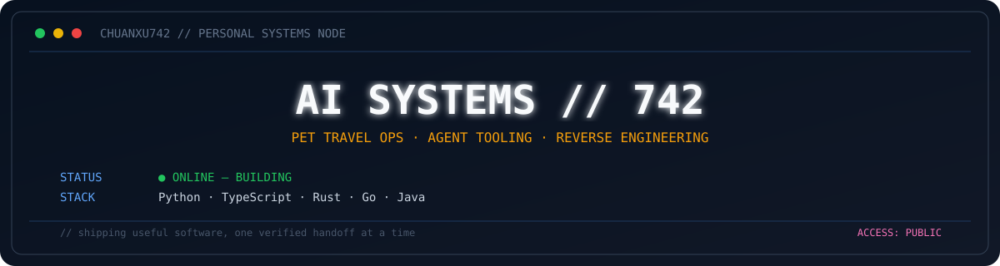

<p align="center"></p>

<h1 align="center">你好，我是 chuanxu742 👋</h1>

<p align="center">
  全栈开发者 · AI Agent 工具链 · 宠物国际运输业务系统
</p>

<p align="center">
  <a href="https://github.com/chuanxu742-glitch?tab=repositories">Repositories</a> ·
  <a href="https://github.com/chuanxu742-glitch/qa-cli">qa-cli</a> ·
  <a href="https://github.com/chuanxu742-glitch/xhs_rs">xhs_rs</a>
</p>

## 当前在做

- **宠物出境合规自动化**：证明文件批量生成、AI 材料抽取、案件与许可流程管理
- **航司服务犬申请自动化**：覆盖 80+ 航司的表单填报、PDF 预填与引导话术
- **AI Agent 协作开发**：多 session 并行调度、Git worktree 生命周期与可验证 handoff

## 精选项目

| 项目 | 说明 | 技术栈 |
|---|---|---|
| [xhs_rs](https://github.com/chuanxu742-glitch/xhs_rs) | 小红书 Web 接口签名算法 Rust 实现，包含设备指纹与会话管理 | Rust |
| [qa-cli](https://github.com/chuanxu742-glitch/qa-cli) | Agent-first 的 QA 工作流 CLI，支持本地与 CI 执行 | Rust |
| [TrendRadar](https://github.com/chuanxu742-glitch/TrendRadar) | 宠物托运政策监控与 AI 政策变动汇总 | Python |

## 技术栈

<p>
  
</p>

```text
Languages  Python · TypeScript · Rust · Go · Java
Backend    FastAPI · Express · Spring Boot · Prisma · PostgreSQL
Frontend   Next.js · Vue 3 · React · Tailwind CSS · Electron
Tools      Playwright · Docker · Claude Code · Codex
```

---

<p align="center"><sub>大部分业务项目为私有仓库 · Building useful software, one verified handoff at a time.</sub></p>
