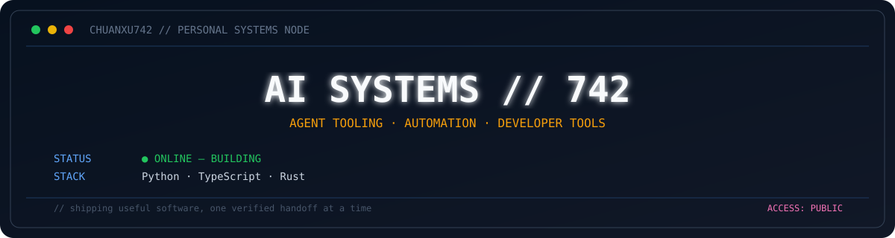

  

<h1 align="center">你好，我是 chuanxu742 👋</h1>

<strong>全栈开发 · AI Agent 工具链 · 自动化与开发者工具</strong>

把重复工作交给工具，把想法做成可运行、可验证的软件。

  <a href="#精选项目">精选项目</a> ·
  <a href="https://github.com/chuanxu742-glitch?tab=repositories">全部仓库</a> ·
  <a href="https://github.com/chuanxu742-glitch/qa-cli/issues">交流与反馈</a>

## 关于我

我关注 AI 与工程实践的结合，围绕 Agent 协作、自动化测试、浏览器工具和信息处理构建软件。常用 Python、TypeScript 与 Rust，重视清晰的接口、可复现的流程和有证据的验证。

- **Agent 工具链**：让 AI 编码工具融入开发、测试与交付流程。
- **自动化与质量**：用 CLI、浏览器自动化和本地 / CI 工作流减少重复操作。
- **研究与信息处理**：将数据采集、AI 处理和证据关联组织成可追溯的工作流。

## 精选项目

| 项目 | 解决什么问题 | 主要语言 |
| :--- | :--- | :--- |
| [qa-cli](https://github.com/chuanxu742-glitch/qa-cli) | 面向 AI Agent 的 QA 工作流 CLI，支持本地与 CI 执行 | Rust |
| [browser-profile-studio](https://github.com/chuanxu742-glitch/browser-profile-studio) | 浏览器配置隔离与受策略约束的 Firefox 自动化工作台 | TypeScript |
| [threadbeacon](https://github.com/chuanxu742-glitch/threadbeacon) | 面向 Agent 的研究与情报工作流平台 | TypeScript |
| [gemini-rust-gateway](https://github.com/chuanxu742-glitch/gemini-rust-gateway) | Rust 实现的 Gemini Web 网关，提供 API 兼容与多账户故障切换 | Rust |
| [pixel-rebuild](https://github.com/chuanxu742-glitch/pixel-rebuild) | 从截图重建前端界面，并通过视觉证据验证结果的 Agent Skill | JavaScript |
| [geo-platform](https://github.com/chuanxu742-glitch/geo-platform) | 本地优先的 SEO / GEO 工作流，串联诊断、人工审阅与发布验证 | Python |

## 技术与工具

| 方向 | 常用技术 |
| :--- | :--- |
| 主要语言 | Python · TypeScript · Rust |
| 前端与桌面 | React · Next.js · Vue 3 · Tailwind CSS · Electron |
| 后端与数据 | FastAPI · Express · PostgreSQL · Prisma |
| 自动化与协作 | Playwright · Docker · Git · Codex · Claude Code |

欢迎在相关项目的 Issues 中交流使用体验、问题和改进建议。

---

Build useful tools. Keep the workflow clear. Verify what ships.

